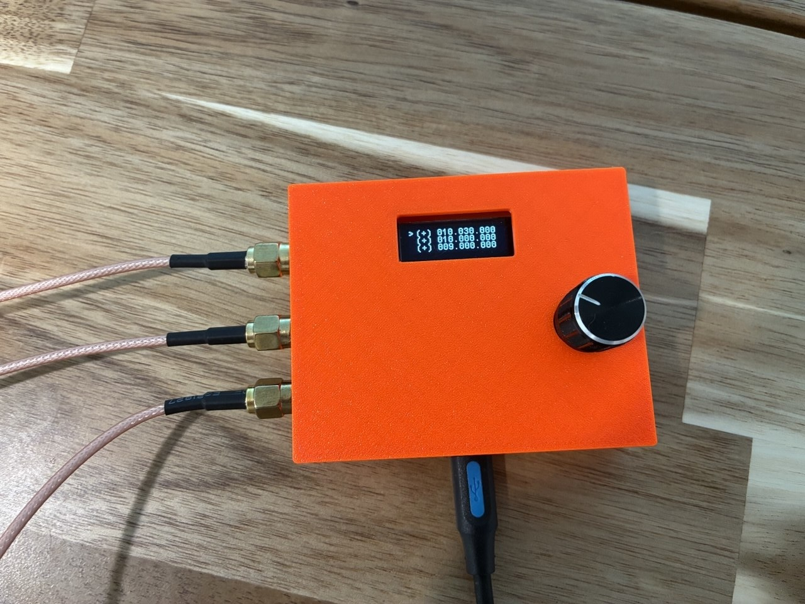

# SI5351 Signal Generator

A compact, multi-channel signal generator based on the **STM32** microcontroller and the **Si5351** I²C programmable clock generator. Capable of generating signals from DC up to 100 MHz, featuring dedicated quadrature ($90^\circ$) phase-shifted outputs.

---

## 📸 Overview



---

## ✨ Features

- **Wide Frequency Range:** DC – 100 MHz
- **3 Independent Output Channels:**
  - **Channel 1:** Independent output channel
  - **Channel 2:** Primary phase reference ($0^\circ$)
  - **Channel 3:** Quadrature output ($90^\circ$ relative to Channel 2)
- **Microcontroller Controlled:** Configured via onboard STM32 over I²C
- **Selectable Drive Current:** 2mA, 4mA, 6mA, or 8mA output drive levels

---

## 📊 Technical Specifications

| Parameter | Specification | Notes |
| :--- | :--- | :--- |
| **Frequency Range** | DC to 100 MHz | High-frequency stability via Si5351 Multisynth |
| **Output Waveform** | Square wave (LVCMOS) | 3.3V logic levels |
| **Phase Shift** | $0^\circ$ and $90^\circ$ (Quadrature) | Available between Ch 2 and Ch 3 |
| **Control Interface** | I²C Bus | Communicates with STM32 host |
| **Output Load** | 50 $\Omega$ compatible | Buffer recommended for high loads |

---

## 🛠 Hardware & Schematics

- 📄 **Schematic (PDF):** [View Schematic PDF](pcb/stm32_si5351_siggen_2026-08-28.pdf)

### Pinout Configuration

| Channel | Signal | Phase | Description |
| :---: | :---: | :---: | :--- |
| **CLK0** | Ch 1 | N/A | Standalone signal generator channel |
| **CLK1** | Ch 2 | $0^\circ$ | Quadrature pair - Reference |
| **CLK2** | Ch 3 | $+90^\circ$ | Quadrature pair - Phase shifted |

---

## 🚀 Getting Started

### Prerequisites

- **Toolchain:** ARM GNU Toolchain (`arm-none-eabi-gcc`)
- **Flashing Tool:** OpenOCD
- **Hardware:** STM32 SWD Programmer (ST-Link V2 / V3)

### Building and Flashing

1. **Clone the repository:**
   ```bash
   git clone [https://github.com/your-username/stm32-si5351-siggen.git](https://github.com/your-username/stm32-si5351-siggen.git)
   cd stm32-si5351-siggen
2. Compile and Upload
    ```bash
    make
    make upload
    ```
